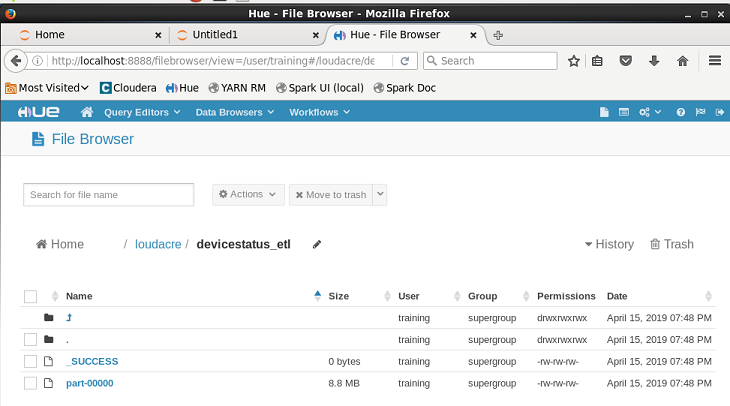
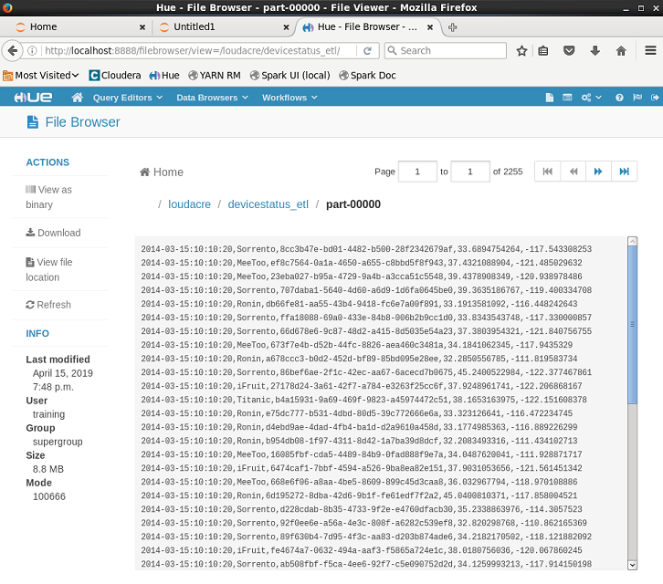

안녕하세요 전략사업팀 도종희선임입니다.

실습 예제는 아래와 같습니다.


#### 실습보너스 #1

-------------------------------------------------------------------------------------------

파이썬 실습코드 입니다.

```python
devicestatus_files="/loudacre/devicestatus.txt"

#필터 값을 이용하여 조건에 맞는 데이터 추출
myrdd1 = sc.textFile(devicestatus_files)\
    .filter(lambda val: len(val) > 20)\
    .map(lambda val: val.split(val[19:20]))\
    .filter(lambda val: len(val) == 14)

#데이터 확인
#myrdd1.take(2)


#날짜, 제조사, 장비ID, 경위도값만 남김
myrdd2 = myrdd1\
    .map(lambda val: (val[0], val[1].split(' ')[0], val[2], val[12], val[13]))\
    .map(lambda val: ','.join(val)) 
    
#데이터 확인    
#myrdd2.take(2)    

#해당경로에 저장
myrdd2.saveAsTextFile("/loudacre/devicestatus_etl")
```


다음은 해당 코드를 실행한 결과 입니다.

```

```




